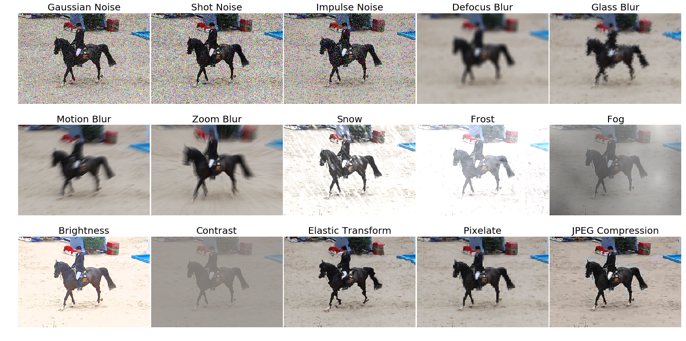

# Corruption Benchmarking

## Introduction

We provide tools to test object detection and instance segmentation models on the image corruption benchmark defined in [Benchmarking Robustness in Object Detection: Autonomous Driving when Winter is Coming](https://arxiv.org/abs/1907.07484).
This page provides basic tutorials how to use the benchmark.

```latex
@article{michaelis2019winter,
  title={Benchmarking Robustness in Object Detection:
    Autonomous Driving when Winter is Coming},
  author={Michaelis, Claudio and Mitzkus, Benjamin and
    Geirhos, Robert and Rusak, Evgenia and
    Bringmann, Oliver and Ecker, Alexander S. and
    Bethge, Matthias and Brendel, Wieland},
  journal={arXiv:1907.07484},
  year={2019}
}
```



## About the benchmark

To submit results to the benchmark please visit the [benchmark homepage](https://github.com/bethgelab/robust-detection-benchmark)

The benchmark is modelled after the [imagenet-c benchmark](https://github.com/hendrycks/robustness) which was originally
published in [Benchmarking Neural Network Robustness to Common Corruptions and Perturbations](https://arxiv.org/abs/1903.12261) (ICLR 2019) by Dan Hendrycks and Thomas Dietterich.

The image corruption functions are included in this library but can be installed separately using:

```shell
pip install imagecorruptions
```

Compared to imagenet-c a few changes had to be made to handle images of arbitrary size and greyscale images.
We also modfied the 'motion blur' and 'snow' corruptions to remove dependency from a linux specific library,
which would have to be installed separately otherwise. For details please refer to the [imagecorruptions repository](https://github.com/bethgelab/imagecorruptions).

## Inference with pretrained models

We provide a testing script to evaluate a models performance on any combination of the corruptions provided in the benchmark.

### Test a dataset

- [x] single GPU testing
- [ ] multiple GPU testing
- [ ] visualize detection results

You can use the following commands to test a models performance under the 15 corruptions used in the benchmark.

```shell
# single-gpu testing
python tools/test_robustness.py ${CONFIG_FILE} ${CHECKPOINT_FILE} [--out ${RESULT_FILE}] [--eval ${EVAL_METRICS}]
```

Alternatively different group of corruptions can be selected.

```shell
# noise
python tools/test_robustness.py ${CONFIG_FILE} ${CHECKPOINT_FILE} [--out ${RESULT_FILE}] [--eval ${EVAL_METRICS}] --corruptions noise

# blur
python tools/test_robustness.py ${CONFIG_FILE} ${CHECKPOINT_FILE} [--out ${RESULT_FILE}] [--eval ${EVAL_METRICS}] --corruptions blur

# wetaher
python tools/test_robustness.py ${CONFIG_FILE} ${CHECKPOINT_FILE} [--out ${RESULT_FILE}] [--eval ${EVAL_METRICS}] --corruptions weather

# digital
python tools/test_robustness.py ${CONFIG_FILE} ${CHECKPOINT_FILE} [--out ${RESULT_FILE}] [--eval ${EVAL_METRICS}] --corruptions digital
```

Or a costom set of corruptions e.g.:

```shell
# gaussian noise, zoom blur and snow
python tools/test_robustness.py ${CONFIG_FILE} ${CHECKPOINT_FILE} [--out ${RESULT_FILE}] [--eval ${EVAL_METRICS}] --corruptions gaussian_noise zoom_blur snow
```

Finally the corruption severities to evaluate can be chosen.
Severity 0 corresponds to clean data and the effect increases from 1 to 5.

```shell
# severity 1
python tools/test_robustness.py ${CONFIG_FILE} ${CHECKPOINT_FILE} [--out ${RESULT_FILE}] [--eval ${EVAL_METRICS}] --severities 1

# severities 0,2,4
python tools/test_robustness.py ${CONFIG_FILE} ${CHECKPOINT_FILE} [--out ${RESULT_FILE}] [--eval ${EVAL_METRICS}] --severities 0 2 4
```
